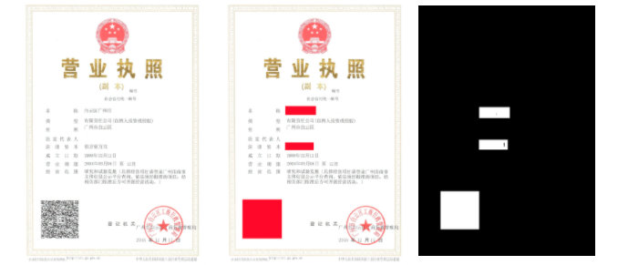
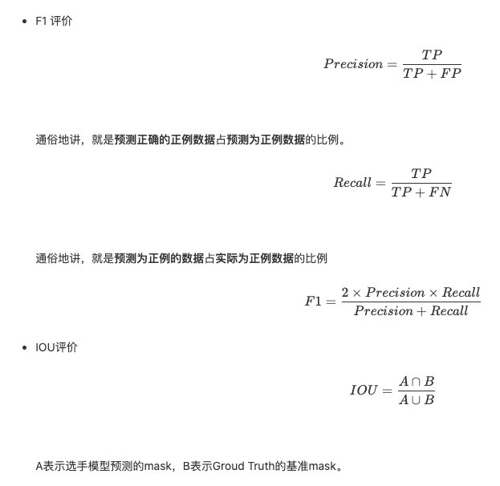

[TOC]

# 0 队伍简介

**队伍名称：** 猛狗哭泣

**公榜 A 排名：** 31/1470

**私榜 A 排名: ** 33/1470

Code Repo: https://github.com/AshinWang/tianchi-competition-5-manipulation-detection/


#  1 比赛简介

比赛本质上就是图像分割。

> **大赛名称：**安全AI挑战者计划第五期：伪造图像的篡改检测-赛道2
>
> **官方简介：** https://tianchi.aliyun.com/competition/entrance/531812/introduction  赛道2（10月12日10:00AM (UTC+8)开启，赛道1报名选手无需重复报名）伪造图像的对抗攻击比赛的赛道1——攻击比赛已经接近尾声，很多高质量的P图不但骗过人眼，还成功骗过我们提供的4个经典检测模型，那是否就真的是“魔高一丈”（反取证技术）呢？我们的对抗攻击比赛开始进入赛道2——检测比赛将在10月12日10:00AM (UTC+8)拉开帷幕！设计出“火眼金睛”（检测算法），把别人的“挖坑”（篡改区域）一一识别出来。区别于以往的图像取证比赛专注于自然内容图像，我们比赛采用的数据为大量伪造的证书文档类图像。任务是通过提供的训练集学习出有效的检测算法，对测试集的伪造图像进行篡改定位。为了更好的评价选手的检测定位效果，我们设计了全面的得分计算准则。


## A 数据形式

- 数据包括训练集和测试集，训练集有1500张JPEG图像及对应mask（分辨率与原图保持一致，像素值0表示该像素标识为未篡改，像素值1表示该像素标识为篡改），JPEG图像的EXIF信息均被擦除，除部分无后处理外，其它可能经过裁边、平滑、下采样、社交工具传输（没有使用组合方式）；测试集有1500张JPEG图像，处理过程与训练集一致；允许使用集外数据进行训练学习。
- 参赛者提交数据时，利用我们提供的python程序生成mask，对1500张mask图像打包上传。
- 篡改图像可能包括如splicing、copy-move、object removal等任意操作，部分进行后处理（JPEG压缩、重采样、裁剪边缘等）。
- 不需要考虑图像的元数据（已经被擦除）。

+ **示例**
  


## B 评估标准




# 3 解决方案

## A 运行环境

整个实验在 `Google Colab` 下完成，应主办方提交要求改写了 `.py` 方式，并通过了本地测试。

### 主要依赖库

- tensorflow ==2.1.0
- keras == 2.3.0
- segmentation-models==1.0.1


###  NoteBook

+ Colab Pro
  + GPU   Tesla v100 16G
  
  + RAM   25G
  

### .py

1. 安装依赖库

   `pip3 install -r requirements.txt `

2. 训练

   `$ cd code`
   `$ ./trian.sh`

3. 测试

   `$ cd code`
   `$ ./run.sh`

   

## B 数据处理

+ 将图像数据准换为 np 形式的正方形矩阵，其中
  + **trian**             resize(512, 512, 3)
  
  + **train_mask** resize(512, 512, 1)
  
  + **test**               resize(512, 512, 3)
  
    

图像的平均长宽在 1200 左右，一开始 resize 到 `1024*1024*3`，直接爆内存（25 GiB）， `512*512*3` 的尺寸在 Colab 上基本上达到了训练极限，尽管 `256*256` 占用小了很多，但是训练模型的效果不好，最终还是将训练集 resize 为 `512*512*3`。


## C 图像增强

+ horizontal_flip
+ vertical_flip

```python
# Data Generator and augmentation
data_gen_args = dict(horizontal_flip=True,vertical_flip=True)
image_datagen = ImageDataGenerator(**data_gen_args)
mask_datagen = ImageDataGenerator(**data_gen_args)
```


## D Metric

```python
# Dice_Coeff or F1 score
def metric(y_true, y_pred):
    y_true_f = K.flatten(y_true)
    y_pred_f = K.flatten(y_pred)
    intersection = K.sum(y_true_f * y_pred_f)
    return (2. * intersection + 1) / (K.sum(y_true_f) + K.sum(y_pred_f) + 1)
```


## E 模型训练

使用公开的分割模型 Repo: https://github.com/qubvel/segmentation_models

Segmentation model = UNet

Backbone = efficientnetb3

| Type         | Names                                                        |
| ------------ | ------------------------------------------------------------ |
| VGG          | 'vgg16' 'vgg19'                                              |
| ResNet       | 'resnet18' 'resnet34' 'resnet50' 'resnet101' 'resnet152'     |
| SE-ResNet    | 'seresnet18' 'seresnet34' 'seresnet50' 'seresnet101' 'seresnet152' |
| ResNeXt      | 'resnext50' 'resnext101'                                     |
| SE-ResNeXt   | 'seresnext50' 'seresnext101'                                 |
| SENet154     | 'senet154'                                                   |
| DenseNet     | 'densenet121' 'densenet169' 'densenet201'                    |
| Inception    | 'inceptionv3' 'inceptionresnetv2'                            |
| MobileNet    | 'mobilenet' 'mobilenetv2'                                    |
| EfficientNet | 'efficientnetb0' 'efficientnetb1' 'efficientnetb2' 'efficientnetb3' 'efficientnetb4' 'efficientnetb5' efficientnetb6' efficientnetb7' |

> All backbones have weights trained on 2012 ILSVRC ImageNet dataset (`encoder_weights='imagenet'`).


```python
# Unet + efficientnetb3
model_name = 'Unet'
backbone_name = 'efficientnetb3'
model = Unet(backbone_name, classes=1, activation='sigmoid')
model.compile(optimizer=Adam(), loss="binary_crossentropy", metrics=metric)

seed = 42
bs = 32 # BacthSize
nb_epochs = 100 # epoch

image_generator = image_datagen.flow(X_train, seed=seed, batch_size=bs, shuffle=True)
mask_generator = mask_datagen.flow(y_train, seed=seed, batch_size=bs, shuffle=True)

# Just zip the two generators to get a generator that provides augmented images and masks at the same time
train_generator = zip(image_generator, mask_generator)

results = model.fit_generator(train_generator, steps_per_epoch=(spe), epochs=nb_epochs,validation_data=(X_valid, y_valid),callbacks=[save,lr_schedule,reduce_lr])
```


## F 模型预测

预测测试集的图像时，将 test 转化为 `512*512*3` 的图像，再经过模型篡改区域预测后得到 `512*512*1`的 test_mask，再将 mask resize 到图像本身的长宽。这样 resize 来回应该会影响预测效果吧！！！但不 resize 会报错。~_~

```python
TEST_MASK_PATH = '../prediction_result/images/'
predicted_test = model.predict(X_test)

# Save test mask
print('Get img name and path')
each_test_name = []
each_test_path = []

for i in tqdm(list({i.split('.')[0] for i in os.listdir(TEST_PATH)})):
    i = i.split('.')[0]
    each_test_path.append(TEST_PATH + '{}.jpg'.format(i))
    each_test_name.append(i) 

each_test_path.remove(each_test_path[0])
each_test_name.remove(each_test_name[0])
print(each_test_path[0])
print(each_test_name[0])

# Resize mask
print('Get img height and width')
h = []
w = []
for filename in tqdm(each_test_path):
    temp = Image.open(filename)
    h.append(temp.height)
    w.append(temp.width)

print('Resize and save img')
for index in tqdm(range(0,1500)):
    pred = np.squeeze(predicted_test[index])
    plt.imsave('pred_mask.png',pred)
    im_gray = cv2.imread('pred_mask.png', cv2.IMREAD_GRAYSCALE)
    (thresh, im_bw) = cv2.threshold(im_gray, 220, 255, cv2.THRESH_BINARY | cv2.THRESH_OTSU)

    im_bw_t = Image.fromarray(im_bw) 
    im_bw_t.save(TEST_MASK_PATH+'{}.png'.format(each_test_name[index]))
        
    im_bw_t_n = Image.open(TEST_MASK_PATH+'{}.png'.format(each_test_name[index]))
    im_bw_t_nn = im_bw_t_n.resize(( w[index], h[index]),Image.ANTIALIAS)
    im_bw_t_nn.save(TEST_MASK_PATH+'{}.png'.format(each_test_name[index]))
print('DONE! Save mask img！')
```


# 4 总结

本次比赛，由于时间和硬件资源不够，仅在 Colab 上采用了 `UNet + efficientnetb3` 进行了实验。还有许多可以提升的地方，例如

+ Backbone（inceptionresnetv2, efficientnetb7）

+ 损失函数

+ 图像扩增

+ 打伪标签

  在训练集中，未篡改的图像可通过 mask 来判断。把测试集中的一些明显未篡改的图像，打上全黑的 mask，加入到训练集。一是 Colab 内存不够，二是害怕判定作弊，没加。

  ```python
  for i,img in tqdm(zip(list({i.split('.')[0] for i in os.listdir(TRAIN_PATH)}), range(0,len(os.listdir(TRAIN_PATH))))):
    
      image= cv2.imread(train_data[img])
      mask = cv2.imread(mask_data[img],0)
  
      if cv2.countNonZero(mask) == 0:
          cv2.imwrite(path+'train_ok/{}.jpg'.format(i), image)
          cv2.imwrite(path+'train_ok_mask/{}.png'.format(i), mask)
      else: pass    
  print(len(path+ 'train_ok/'), len(path+ 'train_ok_mask/'))
  ```

+ 训练策略

  + epoch 和 学习率
  + 低分辨率 --> 高分辨率

+ 测试集不 Resize


#  5 更多参考技巧

+ https://github.com/qubvel/segmentation_models

+ https://neptune.ai/blog/ml-experiment-tracking

+ https://zhuanlan.zhihu.com/p/252228151
